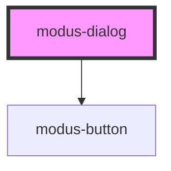

# modus-dialog

<!-- Auto Generated Below -->

## Properties

| Property              | Attribute               | Description                                             | Type      | Default          |
| --------------------- | ----------------------- | ------------------------------------------------------- | --------- | ---------------- |
| `headerText`          | `header-text`           | (optional) The text to display in the header.           | `string`  | `undefined`      |
| `primaryButtonText`   | `primary-button-text`   | (optional) The text to display in the primary button.   | `string`  | `'Save Changes'` |
| `secondaryButtonText` | `secondary-button-text` | (optional) The text to display in the secondary button. | `string`  | `'Close'`        |
| `showSecondaryButton` | `show-secondary-button` | (optional) Whether to show the secondary button.        | `boolean` | `true`           |
| `visible`             | `visible`               | (optional) Whether to show the dialog.                  | `boolean` | `false`          |

## Events

| Event                  | Description                                               | Type               |
| ---------------------- | --------------------------------------------------------- | ------------------ |
| `dialogClose`          | (optional) An event that fires on close.                  | `CustomEvent<any>` |
| `primaryButtonClick`   | (optional) An event that fires on primary button click.   | `CustomEvent<any>` |
| `secondaryButtonClick` | (optional) An event that fires on secondary button click. | `CustomEvent<any>` |

## Dependencies

### Depends on

- [modus-button](../modus-button)

### Graph

----------------------------------------------

