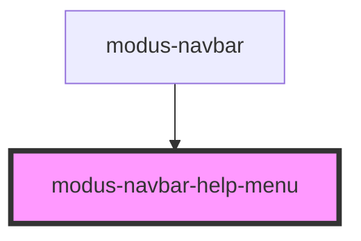

# modus-navbar-help-menu

<!-- Auto Generated Below -->

## Properties

| Property  | Attribute | Description | Type      | Default     |
| --------- | --------- | ----------- | --------- | ----------- |
| `reverse` | `reverse` |             | `boolean` | `undefined` |

## Dependencies

### Used by

 - [modus-navbar](..)

### Graph

----------------------------------------------

