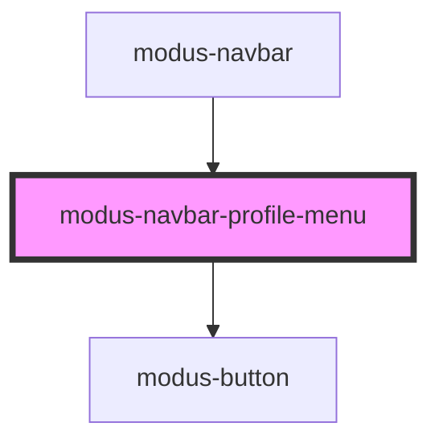

# modus-navbar-profile-menu

<!-- Auto Generated Below -->

## Properties

| Property    | Attribute    | Description | Type     | Default     |
| ----------- | ------------ | ----------- | -------- | ----------- |
| `avatarUrl` | `avatar-url` |             | `string` | `undefined` |
| `email`     | `email`      |             | `string` | `undefined` |
| `initials`  | `initials`   |             | `string` | `undefined` |
| `username`  | `username`   |             | `string` | `undefined` |

## Events

| Event          | Description | Type                      |
| -------------- | ----------- | ------------------------- |
| `signOutClick` |             | `CustomEvent<MouseEvent>` |

## Dependencies

### Used by

 - [modus-navbar](..)

### Depends on

- [modus-button](../../modus-button)

### Graph

----------------------------------------------

