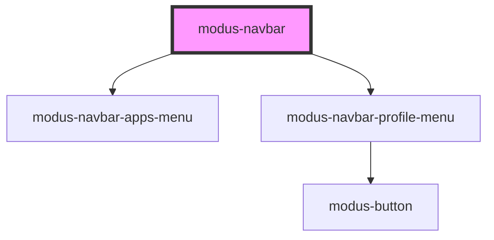

# modus-button

<!-- Auto Generated Below -->

## Properties

| Property             | Attribute            | Description                                     | Type                                                                           | Default     |
| -------------------- | -------------------- | ----------------------------------------------- | ------------------------------------------------------------------------------ | ----------- |
| `apps`               | --                   | (optional) The apps to render in the apps menu. | `App[]`                                                                        | `undefined` |
| `productLogoOptions` | --                   | (required) Product logo options.                | `{ url: string; }`                                                             | `undefined` |
| `profileMenuOptions` | --                   | (required) Profile menu options.                | `{ avatarUrl?: string; email?: string; initials?: string; username: string; }` | `undefined` |
| `showAppsMenu`       | `show-apps-menu`     | (optional) Whether to show the apps menu.       | `boolean`                                                                      | `undefined` |
| `showHelpMenu`       | `show-help-menu`     | (optional) Whether to show the help menu.       | `boolean`                                                                      | `undefined` |
| `showMainMenu`       | `show-main-menu`     | (optional) Whether to show the main menu.       | `boolean`                                                                      | `undefined` |
| `showNotifications`  | `show-notifications` | (optional) Whether to show notifications.       | `boolean`                                                                      | `undefined` |
| `showSearch`         | `show-search`        | (optional) Whether to show search.              | `boolean`                                                                      | `undefined` |

## Events

| Event                     | Description                                         | Type                      |
| ------------------------- | --------------------------------------------------- | ------------------------- |
| `productLogoClick`        | An event that fires on product logo click.          | `CustomEvent<MouseEvent>` |
| `profileMenuSignOutClick` | An event that fires on profile menu sign out click. | `CustomEvent<MouseEvent>` |

## Dependencies

### Depends on

- [modus-navbar-apps-menu](apps-menu)
- [modus-navbar-profile-menu](profile-menu)

### Graph

----------------------------------------------

