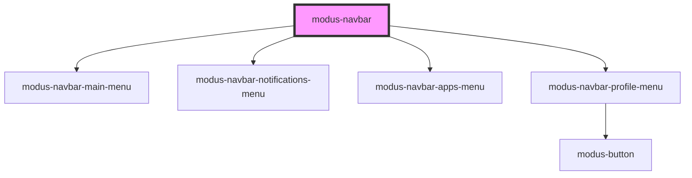

# modus-button

<!-- Auto Generated Below -->

## Properties

| Property               | Attribute                | Description                                                      | Type                                                                           | Default     |
| ---------------------- | ------------------------ | ---------------------------------------------------------------- | ------------------------------------------------------------------------------ | ----------- |
| `apps`                 | --                       | (optional) The apps to render in the apps menu.                  | `App[]`                                                                        | `undefined` |
| `productLogoOptions`   | --                       | (required) Product logo options.                                 | `{ height?: string; url: string; }`                                            | `undefined` |
| `profileMenuOptions`   | --                       | (required) Profile menu options.                                 | `{ avatarUrl?: string; email?: string; initials?: string; username: string; }` | `undefined` |
| `reverse`              | `reverse`                | (optional) Whether to display the navbar items in reverse order. | `boolean`                                                                      | `undefined` |
| `showAppsMenu`         | `show-apps-menu`         | (optional) Whether to show the apps menu.                        | `boolean`                                                                      | `undefined` |
| `showMainMenu`         | `show-main-menu`         | (optional) Whether to show the main menu.                        | `boolean`                                                                      | `undefined` |
| `showNotifications`    | `show-notifications`     | (optional) Whether to show notifications.                        | `boolean`                                                                      | `undefined` |
| `showPendoPlaceholder` | `show-pendo-placeholder` | (optional) Whether to show the placeholder for Pendo.            | `boolean`                                                                      | `undefined` |
| `showSearch`           | `show-search`            | (optional) Whether to show search.                               | `boolean`                                                                      | `undefined` |
| `showShadow`           | `show-shadow`            | (optional) Whether to show a shadow under the navbar.            | `boolean`                                                                      | `undefined` |

## Events

| Event                     | Description                                         | Type                      |
| ------------------------- | --------------------------------------------------- | ------------------------- |
| `productLogoClick`        | An event that fires on product logo click.          | `CustomEvent<MouseEvent>` |
| `profileMenuSignOutClick` | An event that fires on profile menu sign out click. | `CustomEvent<MouseEvent>` |

## Dependencies

### Depends on

- [modus-navbar-main-menu](main-menu)
- [modus-navbar-notifications-menu](notifications-menu)
- [modus-navbar-apps-menu](apps-menu)
- [modus-navbar-profile-menu](profile-menu)

### Graph

----------------------------------------------

