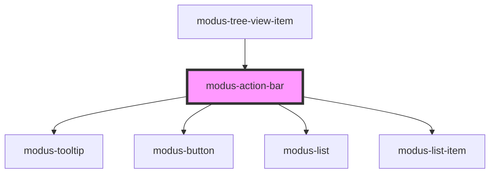

# modus-action-bar

<!-- Auto Generated Below -->

## Properties

| Property           | Attribute            | Description                              | Type                             | Default     |
| ------------------ | -------------------- | ---------------------------------------- | -------------------------------- | ----------- |
| `actions`          | --                   | (optional) List of actions               | `ModusActionBarOptions[]`        | `undefined` |
| `size`             | `size`               | (optional) The size of the action items. | `"large" \| "medium" \| "small"` | `'medium'`  |
| `visibleItemCount` | `visible-item-count` | (optional) Total number of icons to show | `number`                         | `3`         |

## Events

| Event            | Description                                          | Type               |
| ---------------- | ---------------------------------------------------- | ------------------ |
| `actionBarClick` | (optional) An event that fires on action item click. | `CustomEvent<any>` |

## Dependencies

### Used by

 - [modus-tree-view-item](../modus-content-tree/modus-tree-view-item)

### Depends on

- [modus-tooltip](../modus-tooltip)
- [modus-button](../modus-button)
- [modus-list](../modus-list)
- [modus-list-item](../modus-list-item)

### Graph

----------------------------------------------

