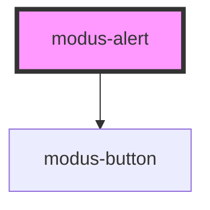

# modus-alert

<!-- Auto Generated Below -->

## Properties

| Property          | Attribute           | Description                                                     | Type                                                                             | Default     |
| ----------------- | ------------------- | --------------------------------------------------------------- | -------------------------------------------------------------------------------- | ----------- |
| `ariaLabel`       | `aria-label`        | (optional) The alert's aria-label.                              | `string`                                                                         | `undefined` |
| `buttonAriaLabel` | `button-aria-label` | (optional) The button's aria-label.                             | `string`                                                                         | `undefined` |
| `buttonText`      | `button-text`       | (optional) The button's text                                    | `string`                                                                         | `undefined` |
| `dismissible`     | `dismissible`       | (optional) Whether the alert has a dismiss button               | `boolean`                                                                        | `undefined` |
| `message`         | `message`           | (optional) The alert message                                    | `string`                                                                         | `undefined` |
| `type`            | `type`              | (optional) The type of alert, sets the color and icon to render | `"error" \| "info" \| "info-gray" \| "info-gray-dark" \| "success" \| "warning"` | `'info'`    |

## Events

| Event          | Description                                            | Type               |
| -------------- | ------------------------------------------------------ | ------------------ |
| `actionClick`  | An event that firest when the action button is clicked | `CustomEvent<any>` |
| `dismissClick` | An event that fires when the alert is dismissed        | `CustomEvent<any>` |

## Dependencies

### Depends on

- [modus-button](../modus-button)

### Graph

----------------------------------------------

