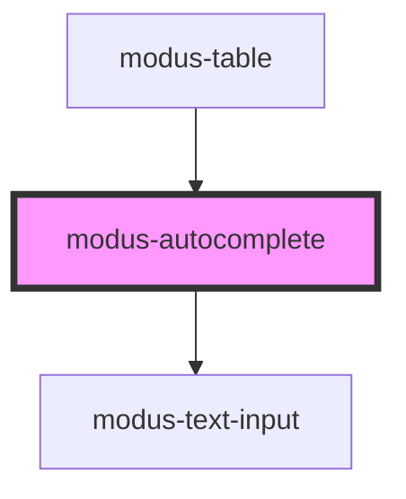

# modus-autocomplete

<!-- Auto Generated Below -->

## Properties

| Property                    | Attribute                       | Description                                   | Type                                    | Default                                       |
| --------------------------- | ------------------------------- | --------------------------------------------- | --------------------------------------- | --------------------------------------------- |
| `ariaLabel`                 | `aria-label`                    | The autocomplete's aria label.                | `string`                                | `undefined`                                   |
| `clearable`                 | `clearable`                     | Whether the input has a clear button.         | `boolean`                               | `false`                                       |
| `disabled`                  | `disabled`                      | Whether the input is disabled.                | `boolean`                               | `undefined`                                   |
| `dropdownMaxHeight`         | `dropdown-max-height`           | The autocomplete's dropdown's max height.     | `string`                                | `'300px'`                                     |
| `dropdownZIndex`            | `dropdown-z-index`              | The autocomplete's dropdown z-index.          | `string`                                | `'1'`                                         |
| `errorText`                 | `error-text`                    | The autocomplete's error text.                | `string`                                | `undefined`                                   |
| `includeSearchIcon`         | `include-search-icon`           | Whether the search icon is included.          | `boolean`                               | `true`                                        |
| `label`                     | `label`                         | The autocomplete's label.                     | `string`                                | `undefined`                                   |
| `noResultsFoundSubtext`     | `no-results-found-subtext`      | The autocomplete's no results sub-text.       | `string`                                | `'Check spelling or try a different keyword'` |
| `noResultsFoundText`        | `no-results-found-text`         | The autocomplete's no results text.           | `string`                                | `'No results found'`                          |
| `options`                   | --                              | The autocomplete's options.                   | `ModusAutocompleteOption[] \| string[]` | `undefined`                                   |
| `placeholder`               | `placeholder`                   | The autocomplete's input placeholder.         | `string`                                | `undefined`                                   |
| `readOnly`                  | `read-only`                     | Whether the autocomplete is read-only.        | `boolean`                               | `undefined`                                   |
| `required`                  | `required`                      | Whether the autocomplete is required.         | `boolean`                               | `undefined`                                   |
| `showNoResultsFoundMessage` | `show-no-results-found-message` | Whether to show the no results found message. | `boolean`                               | `true`                                        |
| `size`                      | `size`                          | The autocomplete's size.                      | `"large" \| "medium"`                   | `'medium'`                                    |
| `value`                     | `value`                         | The autocomplete's search value.              | `string`                                | `undefined`                                   |

## Events

| Event            | Description                                                                  | Type                  |
| ---------------- | ---------------------------------------------------------------------------- | --------------------- |
| `optionSelected` | An event that fires when a dropdown option is selected. Emits the option id. | `CustomEvent<string>` |
| `valueChange`    | An event that fires when the input value changes. Emits the value string.    | `CustomEvent<string>` |

## Dependencies

### Used by

 - [modus-table](../modus-table)

### Depends on

- [modus-text-input](../modus-text-input)

### Graph

----------------------------------------------

