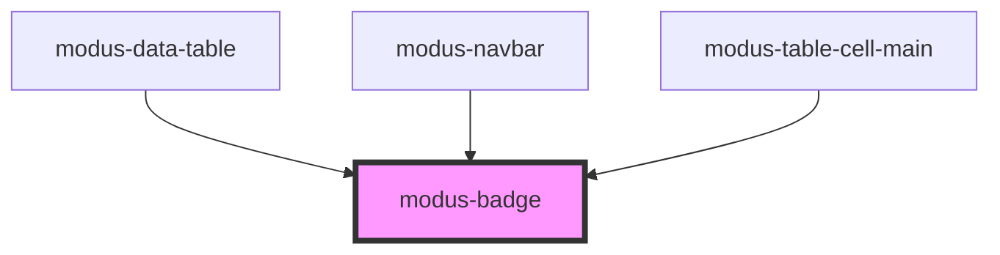

# modus-badge

<!-- Auto Generated Below -->

## Properties

| Property    | Attribute    | Description                       | Type                                                                                     | Default     |
| ----------- | ------------ | --------------------------------- | ---------------------------------------------------------------------------------------- | ----------- |
| `ariaLabel` | `aria-label` | (optional) The badge's aria-label | `string`                                                                                 | `undefined` |
| `color`     | `color`      | (optional) The color of the badge | `"danger" \| "dark" \| "primary" \| "secondary" \| "success" \| "tertiary" \| "warning"` | `'primary'` |
| `size`      | `size`       | (optional) The size of the badge  | `"large" \| "medium" \| "small"`                                                         | `'medium'`  |
| `type`      | `type`       | (optional) The type of the badge  | `"counter" \| "default" \| "text"`                                                       | `'default'` |

## Dependencies

### Used by

 - [modus-data-table](../modus-data-table)
 - [modus-navbar](../modus-navbar)
 - [modus-table-cell-main](../modus-table/parts/cell/modus-table-cell-main)

### Graph

----------------------------------------------

