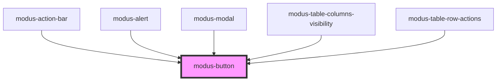

# modus-button

<!-- Auto Generated Below -->

## Properties

| Property       | Attribute       | Description                                                                                | Type                                                 | Default     |
| -------------- | --------------- | ------------------------------------------------------------------------------------------ | ---------------------------------------------------- | ----------- |
| `ariaDisabled` | `aria-disabled` | (optional) The button's aria-disabled state.                                               | `string`                                             | `undefined` |
| `ariaLabel`    | `aria-label`    | (optional) The button's aria-label.                                                        | `string`                                             | `undefined` |
| `buttonStyle`  | `button-style`  | (optional) The style of the button                                                         | `"borderless" \| "fill" \| "outline"`                | `'fill'`    |
| `color`        | `color`         | (optional) The color of the button                                                         | `"danger" \| "primary" \| "secondary" \| "tertiary"` | `'primary'` |
| `disabled`     | `disabled`      | (optional) Disables the button.                                                            | `boolean`                                            | `undefined` |
| `iconOnly`     | `icon-only`     | (optional) Takes the icon name and renders an icon-only button.                            | `string`                                             | `undefined` |
| `leftIcon`     | `left-icon`     | (optional) Takes the icon name and shows the icon aligned to the left of the button text.  | `string`                                             | `undefined` |
| `rightIcon`    | `right-icon`    | (optional) Takes the icon name and shows the icon aligned to the right of the button text. | `string`                                             | `undefined` |
| `showCaret`    | `show-caret`    | (optional) Shows a caret icon right side of the button.                                    | `boolean`                                            | `undefined` |
| `size`         | `size`          | (optional) The size of the button.                                                         | `"large" \| "medium" \| "small"`                     | `'medium'`  |
| `type`         | `type`          | (Optional) Button types                                                                    | `"button" \| "reset" \| "submit" \| "toggle"`        | `'button'`  |

## Events

| Event         | Description                                     | Type               |
| ------------- | ----------------------------------------------- | ------------------ |
| `buttonClick` | (optional) An event that fires on button click. | `CustomEvent<any>` |

## Methods

### `focusButton() => Promise<void>`

Focus the Button

#### Returns

Type: `Promise<void>`

## Dependencies

### Used by

 - [modus-action-bar](../modus-action-bar)
 - [modus-alert](../modus-alert)
 - [modus-modal](../modus-modal)
 - [modus-table-columns-visibility](../modus-table/parts/panel/modus-table-columns-visibility)
 - [modus-table-row-actions](../modus-table/parts/row/actions/modus-table-row-actions)

### Graph

----------------------------------------------

