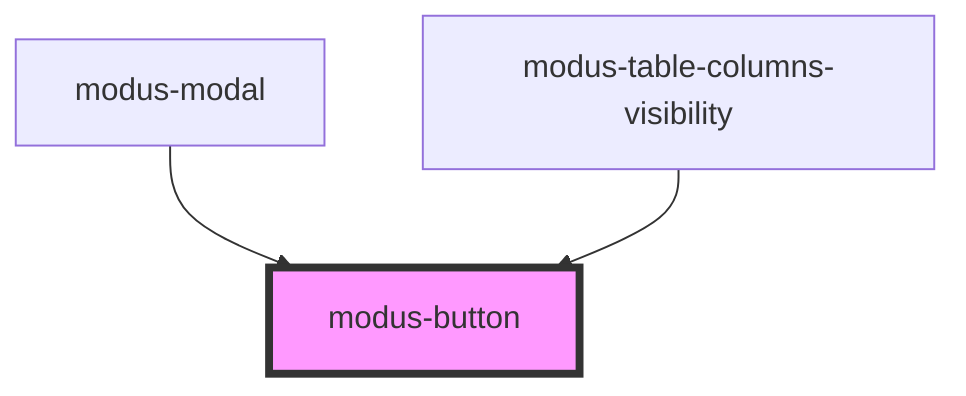

# modus-button

<!-- Auto Generated Below -->

## Properties

| Property      | Attribute      | Description                         | Type                                                 | Default     |
| ------------- | -------------- | ----------------------------------- | ---------------------------------------------------- | ----------- |
| `ariaLabel`   | `aria-label`   | (optional) The button's aria-label. | `string`                                             | `undefined` |
| `buttonStyle` | `button-style` | (optional) The style of the button  | `"borderless" \| "fill" \| "outline"`                | `'fill'`    |
| `color`       | `color`        | (optional) The color of the button. | `"danger" \| "primary" \| "secondary" \| "tertiary"` | `'primary'` |
| `disabled`    | `disabled`     | (optional) Disables the button.     | `boolean`                                            | `undefined` |
| `size`        | `size`         | (optional) The size of the button.  | `"large" \| "medium" \| "small"`                     | `'medium'`  |

## Events

| Event         | Description                                     | Type               |
| ------------- | ----------------------------------------------- | ------------------ |
| `buttonClick` | (optional) An event that fires on button click. | `CustomEvent<any>` |

## Dependencies

### Used by

 - [modus-modal](../modus-modal)
 - [modus-table-columns-visibility](../modus-table/parts/panel/modus-table-columns-visibility)

### Graph

----------------------------------------------

