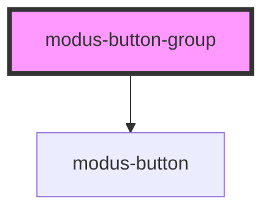

# modus-buttongroup

<!-- Auto Generated Below -->

## Properties

| Property        | Attribute        | Description                             | Type                       | Default                |
| --------------- | ---------------- | --------------------------------------- | -------------------------- | ---------------------- |
| `groupStyle`    | `group-style`    | (optional) The style of the button      | `"fill" \| "outline"`      | `FILL_STYLE`           |
| `selectionType` | `selection-type` | (optional) The selection type of button | `"default" \| "single"`    | `DEFAULT_SELECT__TYPE` |
| `variant`       | `variant`        | (optional) The color of the button      | `"primary" \| "secondary"` | `PRIMARY_VARIANT`      |

## Events

| Event        | Description                                     | Type               |
| ------------ | ----------------------------------------------- | ------------------ |
| `groupClick` | (optional) An event that fires on button click. | `CustomEvent<any>` |

## Dependencies

### Depends on

- [modus-button](../modus-button)

### Graph

----------------------------------------------

