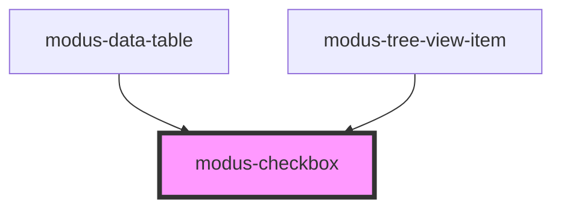

# modus-checkbox

<!-- Auto Generated Below -->

## Properties

| Property        | Attribute         | Description                                       | Type               | Default     |
| --------------- | ----------------- | ------------------------------------------------- | ------------------ | ----------- |
| `ariaLabel`     | `aria-label`      | (optional) The checkbox's aria-label.             | `string`           | `undefined` |
| `checked`       | `checked`         | (optional) Whether the checkbox is checked.       | `boolean`          | `undefined` |
| `disabled`      | `disabled`        | (optional) Whether the checkbox is disabled.      | `boolean`          | `undefined` |
| `indeterminate` | `indeterminate`   | (optional) Whether the checkbox is indeterminate. | `boolean`          | `undefined` |
| `label`         | `label`           | (optional) The checkbox label.                    | `string`           | `undefined` |
| `tabIndexValue` | `tab-index-value` | (optional) Tab Index for the tree item            | `number \| string` | `0`         |

## Events

| Event           | Description                            | Type                   |
| --------------- | -------------------------------------- | ---------------------- |
| `checkboxClick` | An event that fires on checkbox click. | `CustomEvent<boolean>` |

## Dependencies

### Used by

 - [modus-data-table](../modus-data-table)
 - [modus-tree-view-item](../modus-content-tree/modus-tree-view-item)

### Graph

----------------------------------------------

