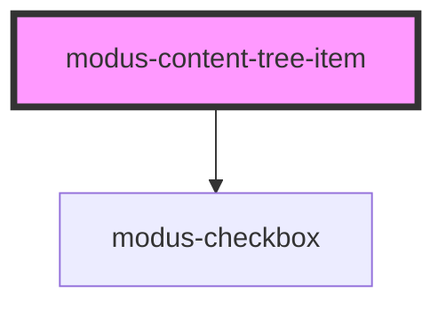

# modus-content-tree-item

<!-- Auto Generated Below -->

## Properties

| Property              | Attribute               | Description                                 | Type                        | Default      |
| --------------------- | ----------------------- | ------------------------------------------- | --------------------------- | ------------ |
| `allowDrag`           | `allow-drag`            | Whether the item can be dragged             | `boolean`                   | `undefined`  |
| `checkboxChecked`     | `checkbox-checked`      | Whether the item's checkbox is checked      | `boolean`                   | `undefined`  |
| `depth`               | `depth`                 | The item's depth                            | `number`                    | `0`          |
| `disabled`            | `disabled`              | (optional) Disables the item                | `boolean`                   | `undefined`  |
| `expandable`          | `expandable`            | Whether the item is expandable              | `boolean`                   | `undefined`  |
| `expanded`            | `expanded`              | Whether the item is expanded                | `boolean`                   | `undefined`  |
| `includeBottomBorder` | `include-bottom-border` | Whether to include the item's bottom border | `boolean`                   | `undefined`  |
| `includeCheckbox`     | `include-checkbox`      | Whether to include the item's checkbox      | `boolean`                   | `undefined`  |
| `includeFolderIcon`   | `include-folder-icon`   | Whether to include the folder icon          | `boolean`                   | `undefined`  |
| `selected`            | `selected`              | (optional) The selected state of the item   | `boolean`                   | `undefined`  |
| `size`                | `size`                  | (optional) The size of the item             | `"condensed" \| "standard"` | `'standard'` |

## Events

| Event           | Description                                | Type                   |
| --------------- | ------------------------------------------ | ---------------------- |
| `checkboxClick` | An event that first on item checkbox click | `CustomEvent<boolean>` |
| `expandClick`   | An event that fires on item expand click   | `CustomEvent<boolean>` |
| `itemClick`     | An event that fires on item click          | `CustomEvent<any>`     |

## Dependencies

### Depends on

- [modus-checkbox](../../modus-checkbox)

### Graph

----------------------------------------------

