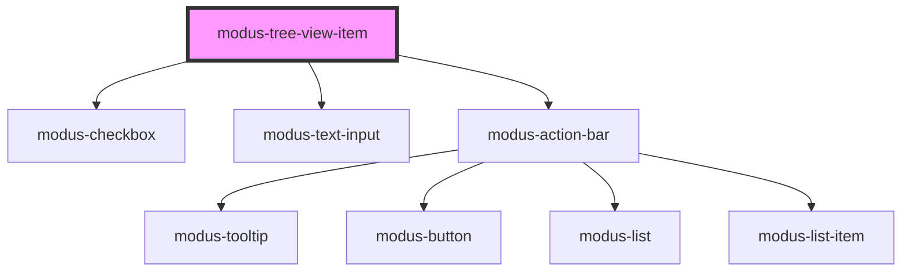

# modus-tree-view-item

<!-- Auto Generated Below -->

## Properties

| Property              | Attribute         | Description                                                                                                                          | Type                      | Default     |
| --------------------- | ----------------- | ------------------------------------------------------------------------------------------------------------------------------------ | ------------------------- | ----------- |
| `actions`             | --                | (optional) Actions that can be performed on each item. A maximum of 3 icons will be shown, including overflow menu and expand icons. | `ModusActionBarOptions[]` | `undefined` |
| `disabled`            | `disabled`        | (optional) Disables the tree item                                                                                                    | `boolean`                 | `undefined` |
| `draggableItem`       | `draggable-item`  | (optional) Allows the item to be dragged across the tree                                                                             | `boolean`                 | `undefined` |
| `droppableItem`       | `droppable-item`  | (optional) Allows the item to be a drop zone so other tree items can be dropped above it                                             | `boolean`                 | `undefined` |
| `editable`            | `editable`        | (optional) Changes the label field into a text box                                                                                   | `boolean`                 | `undefined` |
| `isLastChild`         | `is-last-child`   | To be set true when the tree item is an expandable last child                                                                        | `boolean`                 | `undefined` |
| `label` _(required)_  | `label`           | (required) Label for the tree item                                                                                                   | `string`                  | `undefined` |
| `nodeId` _(required)_ | `node-id`         | (required) Unique tree item identifier                                                                                               | `string`                  | `undefined` |
| `tabIndexValue`       | `tab-index-value` | (optional) Tab Index for the tree item                                                                                               | `number \| string`        | `0`         |

## Events

| Event              | Description                                                                           | Type                   |
| ------------------ | ------------------------------------------------------------------------------------- | ---------------------- |
| `actionClick`      | Fired when an action button within the tree item is clicked. Includes the `actionId`. | `CustomEvent<any>`     |
| `checkboxClick`    | An event that fires on tree item checkbox click                                       | `CustomEvent<boolean>` |
| `itemClick`        | An event that fires on tree item click                                                | `CustomEvent<boolean>` |
| `itemExpandToggle` | An event that fires on tree item expand/collapse                                      | `CustomEvent<boolean>` |

## Methods

### `focusCheckbox() => Promise<void>`

Focus the checkbox inside a tree item

#### Returns

Type: `Promise<void>`

### `focusItem() => Promise<void>`

Focus the tree item

#### Returns

Type: `Promise<void>`

### `setChildren() => Promise<void>`

#### Returns

Type: `Promise<void>`

## Slots

| Slot             | Description                   |
| ---------------- | ----------------------------- |
| `"collapseIcon"` | Slot for custom collapse icon |
| `"dragIcon"`     | Slot for custom drag icon     |
| `"expandIcon"`   | Slot for custom expand icon   |
| `"itemIcon"`     | Slot for custom item icon     |
| `"label"`        | Slot for custom label element |

## Dependencies

### Depends on

- [modus-checkbox](../../modus-checkbox)
- [modus-text-input](../../modus-text-input)
- [modus-action-bar](../../modus-action-bar)

### Graph

----------------------------------------------

