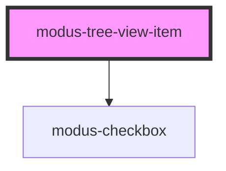

# modus-tree-view-item

<!-- Auto Generated Below -->

## Properties

| Property              | Attribute       | Description                                              | Type      | Default     |
| --------------------- | --------------- | -------------------------------------------------------- | --------- | ----------- |
| `checked`             | `checked`       | (optional) Checked state of the tree item                | `boolean` | `undefined` |
| `disabled`            | `disabled`      | (optional) Disables the tree item                        | `boolean` | `undefined` |
| `expanded`            | `expanded`      | (optional) Expanded state of the tree item               | `boolean` | `undefined` |
| `indeterminate`       | `indeterminate` | (optional) Checkbox indeterminate state of the tree item | `boolean` | `undefined` |
| `label` _(required)_  | `label`         | (required) Label for the tree item                       | `string`  | `undefined` |
| `nodeId` _(required)_ | `node-id`       | (required) Unique tree item identifier                   | `string`  | `undefined` |
| `selected`            | `selected`      | (optional) Selected state of the tree item               | `boolean` | `undefined` |

## Events

| Event              | Description                                      | Type                   |
| ------------------ | ------------------------------------------------ | ---------------------- |
| `checkboxClick`    | An event that fires on tree item checkbox click  | `CustomEvent<boolean>` |
| `itemClick`        | An event that fires on tree item click           | `CustomEvent<boolean>` |
| `itemExpandToggle` | An event that fires on tree item expand/collapse | `CustomEvent<boolean>` |

## Methods

### `focusItem() => Promise<void>`

#### Returns

Type: `Promise<void>`

## Slots

| Slot             | Description                   |
| ---------------- | ----------------------------- |
| `"collapseIcon"` | Slot for custom collapse icon |
| `"dragIcon"`     | Slot for custom drag icon     |
| `"expandIcon"`   | Slot for custom expand icon   |
| `"itemIcon"`     | Slot for custom item icon     |

## Dependencies

### Depends on

- [modus-checkbox](../../modus-checkbox)

### Graph

----------------------------------------------

