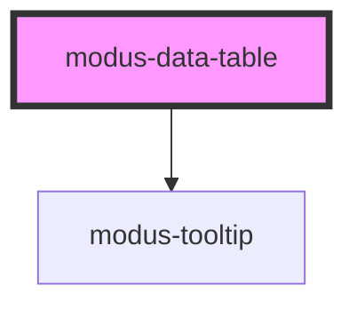

# modus-data-table

<!-- Auto Generated Below -->

## Properties

| Property      | Attribute | Description                         | Type                        | Default                                            |
| ------------- | --------- | ----------------------------------- | --------------------------- | -------------------------------------------------- |
| `columns`     | --        |                                     | `TColumn[] \| string[]`     | `undefined`                                        |
| `data`        | --        |                                     | `TCell[][] \| TRow[]`       | `undefined`                                        |
| `size`        | `size`    | The size of the table.              | `"condensed" \| "standard"` | `'standard'`                                       |
| `sortOptions` | --        | Options for data table column sort. | `ModusTableSortOptions`     | `{     canSort: false,     serverSide: false,   }` |

## Events

| Event  | Description                         | Type                                   |
| ------ | ----------------------------------- | -------------------------------------- |
| `sort` | An event that fires on column sort. | `CustomEvent<ModusDataTableSortEvent>` |

## Dependencies

### Depends on

- [modus-tooltip](../modus-tooltip)

### Graph

----------------------------------------------

