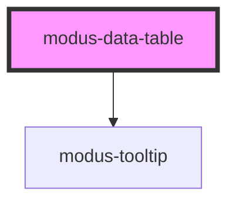

# modus-data-table

<!-- Auto Generated Below -->

## Properties

| Property               | Attribute                 | Description                                     | Type                           | Default                                                   |
| ---------------------- | ------------------------- | ----------------------------------------------- | ------------------------------ | --------------------------------------------------------- |
| `columns` _(required)_ | --                        | (Required) To display headers in the table.     | `ModusDataTableColumn[]`       | `undefined`                                               |
| `data` _(required)_    | --                        | (Required) To display data in the table.        | `unknown[]`                    | `undefined`                                               |
| `displayOptions`       | --                        | (Optional) To control display options of table. | `ModusDataTableDisplayOptions` | `{     borderless: false,     cellBorderless: false,   }` |
| `enableColumnResizing` | `enable-column-resizing`  |                                                 | `boolean`                      | `false`                                                   |
| `hover`                | `hover`                   | (Optional) To enable row hover in table.        | `boolean`                      | `false`                                                   |
| `showSortIconOnHover`  | `show-sort-icon-on-hover` | (Optional) To display sort icon on hover.       | `boolean`                      | `false`                                                   |
| `sort`                 | `sort`                    | (Optional) To sort data in table.               | `boolean`                      | `false`                                                   |

## Events

| Event    | Description                | Type                        |
| -------- | -------------------------- | --------------------------- |
| `onSort` | Emits event on sort change | `CustomEvent<ColumnSort[]>` |

## Dependencies

### Depends on

- [modus-tooltip](../modus-tooltip)

### Graph

----------------------------------------------

