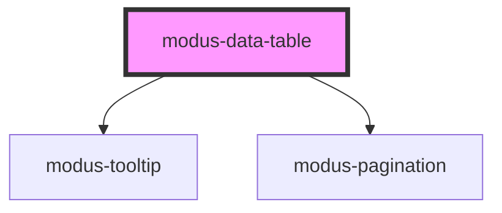

# modus-data-table

<!-- Auto Generated Below -->

## Properties

| Property               | Attribute                 | Description                                     | Type                                       | Default                                                   |
| ---------------------- | ------------------------- | ----------------------------------------------- | ------------------------------------------ | --------------------------------------------------------- |
| `columnResize`         | `column-resize`           |                                                 | `boolean`                                  | `false`                                                   |
| `columns` _(required)_ | --                        | (Required) To display headers in the table.     | `ModusDataTableColumn<unknown, unknown>[]` | `undefined`                                               |
| `data` _(required)_    | --                        | (Required) To display data in the table.        | `unknown[]`                                | `undefined`                                               |
| `displayOptions`       | --                        | (Optional) To control display options of table. | `ModusDataTableDisplayOptions`             | `{     borderless: false,     cellBorderless: false,   }` |
| `fullWidth`            | `full-width`              |                                                 | `boolean`                                  | `true`                                                    |
| `hover`                | `hover`                   | (Optional) To enable row hover in table.        | `boolean`                                  | `false`                                                   |
| `isExpand`             | `is-expand`               | (Optional) To display expanded rows.            | `boolean`                                  | `false`                                                   |
| `pageSizeList`         | --                        |                                                 | `number[]`                                 | `DefaultPageSizes`                                        |
| `pagination`           | `pagination`              |                                                 | `boolean`                                  | `undefined`                                               |
| `showSortIconOnHover`  | `show-sort-icon-on-hover` | (Optional) To display sort icon on hover.       | `boolean`                                  | `false`                                                   |
| `sort`                 | `sort`                    | (Optional) To sort data in table.               | `boolean`                                  | `false`                                                   |
| `summaryRow`           | `summary-row`             | (Optional) To display summary row.              | `boolean`                                  | `false`                                                   |

## Events

| Event        | Description                | Type                        |
| ------------ | -------------------------- | --------------------------- |
| `sortChange` | Emits event on sort change | `CustomEvent<ColumnSort[]>` |

## Methods

### `getColumnData(accessorKey: string) => Promise<unknown[]>`

Returns data of a column.

#### Returns

Type: `Promise<unknown[]>`

: Column data as Array or empty array.

## Slots

| Slot             | Description             |
| ---------------- | ----------------------- |
| `"customFooter"` | Slot for custom footer. |

## Dependencies

### Depends on

- [modus-tooltip](../modus-tooltip)
- [modus-pagination](../modus-pagination)

### Graph

----------------------------------------------

