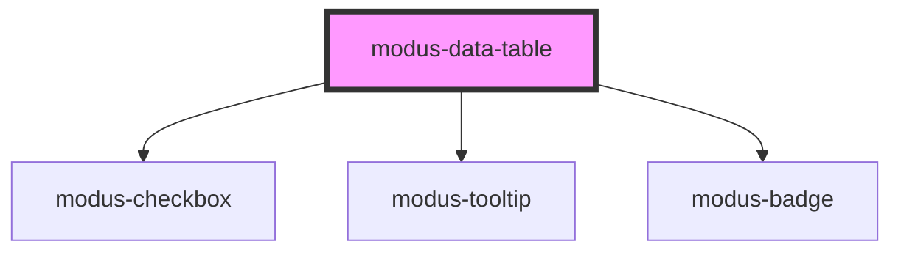

# modus-data-table

<!-- Auto Generated Below -->

## Properties

| Property               | Attribute | Description                            | Type                           | Default                                                                                         |
| ---------------------- | --------- | -------------------------------------- | ------------------------------ | ----------------------------------------------------------------------------------------------- |
| `columns` _(required)_ | --        |                                        | `TColumn[] \| string[]`        | `undefined`                                                                                     |
| `data` _(required)_    | --        |                                        | `TCell[][] \| TRow[]`          | `undefined`                                                                                     |
| `displayOptions`       | --        | Options for data table display.        | `ModusDataTableDisplayOptions` | `{     borderless: true,     cellBorderless: true,     rowStripe: false,     size: 'large'   }` |
| `selectionOptions`     | --        | Options for data table item selection. | `ModusTableSelectionOptions`   | `{     canSelect: false,     checkboxSelection: false,   }`                                     |
| `sortOptions`          | --        | Options for data table column sort.    | `ModusTableSortOptions`        | `{     canSort: false,     serverSide: false,   }`                                              |

## Events

| Event            | Description                              | Type                                   |
| ---------------- | ---------------------------------------- | -------------------------------------- |
| `cellLinkClick`  | An event that fires on cell link click.  | `CustomEvent<ModusDataTableCellLink>`  |
| `rowDoubleClick` | An event that fires on row double click. | `CustomEvent<string>`                  |
| `selection`      | An event that fires on selection change. | `CustomEvent<string[]>`                |
| `sort`           | An event that fires on column sort.      | `CustomEvent<ModusDataTableSortEvent>` |

## Dependencies

### Depends on

- [modus-checkbox](../modus-checkbox)
- [modus-tooltip](../modus-tooltip)
- [modus-badge](../modus-badge)

### Graph

----------------------------------------------

