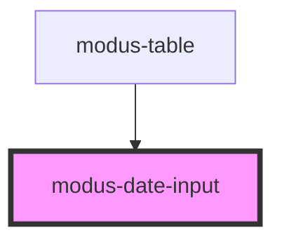

# modus-date-picker-input

<!-- Auto Generated Below -->

## Properties

| Property            | Attribute             | Description                                                                                                                                                                                                       | Type                           | Default        |
| ------------------- | --------------------- | ----------------------------------------------------------------------------------------------------------------------------------------------------------------------------------------------------------------- | ------------------------------ | -------------- |
| `allowedCharsRegex` | `allowed-chars-regex` | (optional) Regular expression to allow characters while typing the input.                                                                                                                                         | `RegExp \| string`             | `undefined`    |
| `ariaLabel`         | `aria-label`          | (optional) The input's aria-label.                                                                                                                                                                                | `string`                       | `undefined`    |
| `autoFocusInput`    | `auto-focus-input`    | (optional) Sets autofocus on the input.                                                                                                                                                                           | `boolean`                      | `undefined`    |
| `disableValidation` | `disable-validation`  | (optional) Disables default validation for the date input.                                                                                                                                                        | `boolean`                      | `undefined`    |
| `disabled`          | `disabled`            | (optional) Whether the input is disabled.                                                                                                                                                                         | `boolean`                      | `undefined`    |
| `errorText`         | `error-text`          | (optional) Custom error text displayed for the input.                                                                                                                                                             | `string`                       | `undefined`    |
| `fillerDate`        | `filler-date`         | (optional) Filler date is used as fillers for parts not in the display format when constructing a full date string, for 'value'. It must be in the ISO String format YYYY-MM-DD. Default is {current year}-01-01. | `string`                       | `undefined`    |
| `format`            | `format`              | Format string for the date input. Default 'mm/dd/yyyy'. Use 'm','mm' for month, 'd','dd' for date and 'yy','yyyy' for year with any separator that is not a regular expression.                                   | `string`                       | `'mm/dd/yyyy'` |
| `helperText`        | `helper-text`         | (optional) Custom helper text displayed below the input.                                                                                                                                                          | `any`                          | `undefined`    |
| `label`             | `label`               | (optional) The input's label.                                                                                                                                                                                     | `string`                       | `undefined`    |
| `placeholder`       | `placeholder`         | (optional) The input's placeholder text.                                                                                                                                                                          | `string`                       | `undefined`    |
| `readOnly`          | `read-only`           | (optional) Whether the input's content is read-only                                                                                                                                                               | `boolean`                      | `undefined`    |
| `required`          | `required`            | (optional) Whether the input is required.                                                                                                                                                                         | `boolean`                      | `undefined`    |
| `showCalendarIcon`  | `show-calendar-icon`  | (optional) Show a calendar icon. Note: Clicking on this icon will only emit an event `calendarIconClicked`.                                                                                                       | `boolean`                      | `undefined`    |
| `size`              | `size`                | (optional) The input's size.                                                                                                                                                                                      | `"large" \| "medium"`          | `'medium'`     |
| `type`              | `type`                | (optional) Denotes what type of date and the types are 'start','end','single'. Required when using `modus-date-picker`.                                                                                           | `"end" \| "single" \| "start"` | `'single'`     |
| `validText`         | `valid-text`          | (optional) The input's valid state text.                                                                                                                                                                          | `string`                       | `undefined`    |
| `value`             | `value`               | (optional) A string representing the date entered in the input. The date is formatted according to ISO8601 'yyyy-mm-dd'. The displayed date format will differ from the 'value'.                                  | `string`                       | `undefined`    |

## Events

| Event                 | Description                                      | Type                                      |
| --------------------- | ------------------------------------------------ | ----------------------------------------- |
| `calendarIconClicked` | An event that fires on calendar icon click.      | `CustomEvent<ModusDateInputEventDetails>` |
| `dateInputBlur`       | An event that fires on input value out of focus. | `CustomEvent<ModusDateInputEventDetails>` |
| `valueChange`         | An event that fires on input value change.       | `CustomEvent<ModusDateInputEventDetails>` |

## Methods

### `focusInput() => Promise<void>`

Focus the input.

#### Returns

Type: `Promise<void>`

## Dependencies

### Used by

 - [modus-table](../modus-table)

### Graph

----------------------------------------------

