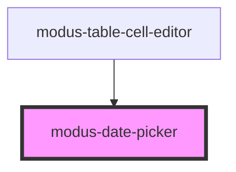

# modus-date-picker

<!-- Auto Generated Below -->

## Properties

| Property        | Attribute  | Description                                                                                                                                                                                                                                                                                                                                                                                                                                                                                                   | Type                                                                                                                                                                                                         | Default          |
| --------------- | ---------- | ------------------------------------------------------------------------------------------------------------------------------------------------------------------------------------------------------------------------------------------------------------------------------------------------------------------------------------------------------------------------------------------------------------------------------------------------------------------------------------------------------------- | ------------------------------------------------------------------------------------------------------------------------------------------------------------------------------------------------------------ | ---------------- |
| `isDateEnabled` | --         | (optional) Function to check if a date is enabled If true, the day will be enabled/interactive. If false, the day will be disabled/non-interactive. The function accepts an ISO 8601 date string of a given day. By default, all days are enabled. Developers can use this function to write custom logic to disable certain days. The function is called for each rendered calendar day, for the previous, current and next month. Custom implementations should be optimized for performance to avoid jank. | `(dateIsoString: string) => boolean`                                                                                                                                                                         | `undefined`      |
| `label`         | `label`    | (optional) Label for the field.                                                                                                                                                                                                                                                                                                                                                                                                                                                                               | `string`                                                                                                                                                                                                     | `undefined`      |
| `position`      | `position` | (optional) The placement of the calendar popup                                                                                                                                                                                                                                                                                                                                                                                                                                                                | `"auto" \| "auto-end" \| "auto-start" \| "bottom" \| "bottom-end" \| "bottom-start" \| "left" \| "left-end" \| "left-start" \| "right" \| "right-end" \| "right-start" \| "top" \| "top-end" \| "top-start"` | `'bottom-start'` |

## Shadow Parts

| Part            | Description |
| --------------- | ----------- |
| `"calendar"`    |             |
| `"date-inputs"` |             |

## Dependencies

### Used by

 - [modus-table-cell-editor](../modus-table/parts/cell/modus-table-cell-editor)

### Graph

----------------------------------------------

