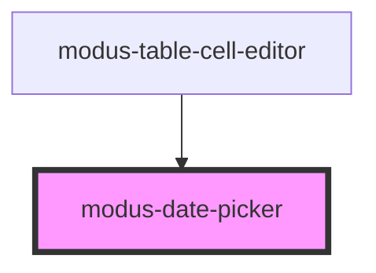

# modus-date-picker

<!-- Auto Generated Below -->

## Properties

| Property | Attribute | Description                     | Type     | Default     |
| -------- | --------- | ------------------------------- | -------- | ----------- |
| `label`  | `label`   | (optional) Label for the field. | `string` | `undefined` |

## Dependencies

### Used by

 - [modus-table-cell-editor](../modus-table/parts/cell/modus-table-cell-editor)

### Graph

----------------------------------------------

