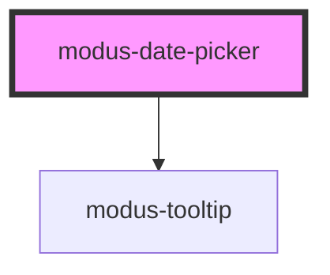

# modus-date-picker

<!-- Auto Generated Below -->

## Properties

| Property | Attribute | Description                     | Type     | Default     |
| -------- | --------- | ------------------------------- | -------- | ----------- |
| `label`  | `label`   | (optional) Label for the field. | `string` | `undefined` |

## Dependencies

### Depends on

- [modus-tooltip](../modus-tooltip)

### Graph

----------------------------------------------

