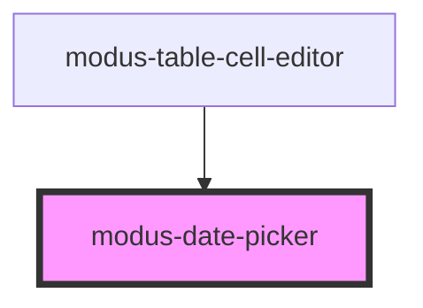

# modus-date-picker

<!-- Auto Generated Below -->

## Properties

| Property            | Attribute            | Description                                    | Type                                                                                                                                                                                                         | Default          |
| ------------------- | -------------------- | ---------------------------------------------- | ------------------------------------------------------------------------------------------------------------------------------------------------------------------------------------------------------------ | ---------------- |
| `calendarPlacement` | `calendar-placement` | (optional) The placement of the calendar popup | `"auto" \| "auto-end" \| "auto-start" \| "bottom" \| "bottom-end" \| "bottom-start" \| "left" \| "left-end" \| "left-start" \| "right" \| "right-end" \| "right-start" \| "top" \| "top-end" \| "top-start"` | `'bottom-start'` |
| `label`             | `label`              | (optional) Label for the field.                | `string`                                                                                                                                                                                                     | `undefined`      |

## Shadow Parts

| Part            | Description |
| --------------- | ----------- |
| `"calendar"`    |             |
| `"date-inputs"` |             |

## Dependencies

### Used by

 - [modus-table-cell-editor](../modus-table/parts/cell/modus-table-cell-editor)

### Graph

----------------------------------------------

