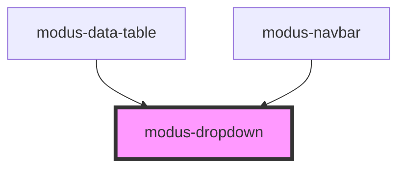

# modus-dropdown

<!-- Auto Generated Below -->

## Properties

| Property                 | Attribute                   | Description                                                                                      | Type                                                                | Default     |
| ------------------------ | --------------------------- | ------------------------------------------------------------------------------------------------ | ------------------------------------------------------------------- | ----------- |
| `animateList`            | `animate-list`              | Whether to apply list opening animation.                                                         | `boolean`                                                           | `false`     |
| `ariaLabel`              | `aria-label`                | (optional) The dropdown's aria-label.                                                            | `string`                                                            | `undefined` |
| `customPlacement`        | --                          | (optional) Determines custom dropdown placement offset.                                          | `{ top?: number; right?: number; bottom?: number; left?: number; }` | `undefined` |
| `disabled`               | `disabled`                  | (optional) Disables the dropdown.                                                                | `boolean`                                                           | `undefined` |
| `placement`              | `placement`                 | (optional) The placement of the dropdown in related to the toggleElement.                        | `"bottom" \| "left" \| "right" \| "top"`                            | `'bottom'`  |
| `showDropdownListBorder` | `show-dropdown-list-border` | (optional) Whether to show the dropdown list's border.                                           | `boolean`                                                           | `true`      |
| `toggleElementId`        | `toggle-element-id`         | (required) The element id that the list renders near and that triggers the toggling of the list. | `string`                                                            | `undefined` |

## Events

| Event           | Description                            | Type               |
| --------------- | -------------------------------------- | ------------------ |
| `dropdownClose` | An event that fires on dropdown close. | `CustomEvent<any>` |

## Dependencies

### Used by

 - [modus-data-table](../modus-data-table)
 - [modus-navbar](../modus-navbar)

### Graph

----------------------------------------------

