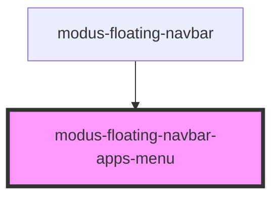

# modus-floating-navbar-apps-menu

<!-- Auto Generated Below -->

## Properties

| Property  | Attribute | Description | Type                       | Default     |
| --------- | --------- | ----------- | -------------------------- | ----------- |
| `apps`    | --        |             | `ModusFloatingNavbarApp[]` | `undefined` |
| `reverse` | `reverse` |             | `boolean`                  | `undefined` |

## Events

| Event     | Description | Type                                  |
| --------- | ----------- | ------------------------------------- |
| `appOpen` |             | `CustomEvent<ModusFloatingNavbarApp>` |

## Dependencies

### Used by

 - [modus-floating-navbar](..)

### Graph

----------------------------------------------

