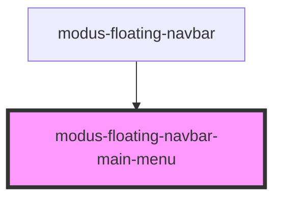

# modus-floating-navbar-main-menu

<!-- Auto Generated Below -->

## Properties

| Property   | Attribute   | Description | Type     | Default     |
| ---------- | ----------- | ----------- | -------- | ----------- |
| `navbarId` | `navbar-id` |             | `string` | `undefined` |

## Dependencies

### Used by

 - [modus-floating-navbar](..)

### Graph

----------------------------------------------

