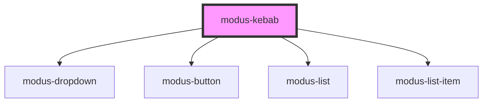

# modus-kebab

<!-- Auto Generated Below -->

## Properties

| Property    | Attribute    | Description | Type                | Default     |
| ----------- | ------------ | ----------- | ------------------- | ----------- |
| `ariaLabel` | `aria-label` |             | `string`            | `undefined` |
| `options`   | --           |             | `KebabOptions[]`    | `undefined` |
| `position`  | `position`   |             | `"left" \| "right"` | `undefined` |

## Dependencies

### Depends on

- [modus-dropdown](../modus-dropdown)
- [modus-button](../modus-button)
- [modus-list](../modus-list)
- [modus-list-item](../modus-list-item)

### Graph

----------------------------------------------

