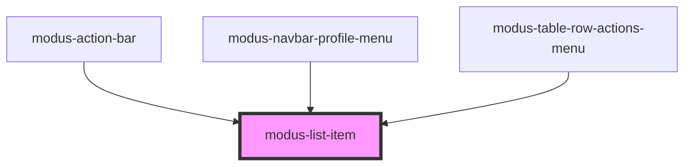

# modus-list-item

<!-- Auto Generated Below -->

## Properties

| Property      | Attribute       | Description                                                      | Type                                   | Default      |
| ------------- | --------------- | ---------------------------------------------------------------- | -------------------------------------- | ------------ |
| `borderless`  | `borderless`    | (optional) Whether the list item has a border or not             | `boolean`                              | `undefined`  |
| `disabled`    | `disabled`      | (optional) Disables the list item                                | `boolean`                              | `undefined`  |
| `leftIcon`    | `left-icon`     |                                                                  | `string`                               | `undefined`  |
| `selected`    | `selected`      | (optional) The selected state of the list item                   | `boolean`                              | `undefined`  |
| `size`        | `size`          | (optional) The size of list item                                 | `"condensed" \| "large" \| "standard"` | `'standard'` |
| `subText`     | `sub-text`      | (optional) Whether to show Subtext below the Slot content or not | `string`                               | `undefined`  |
| `type`        | `type`          | (optional) The type of list item                                 | `string`                               | `'standard'` |
| `wrapSubText` | `wrap-sub-text` | (optional) Whether to wrap the sub text.                         | `boolean`                              | `true`       |

## Events

| Event       | Description                            | Type               |
| ----------- | -------------------------------------- | ------------------ |
| `itemClick` | An event that fires on list item click | `CustomEvent<any>` |

## Methods

### `focusItem() => Promise<void>`

#### Returns

Type: `Promise<void>`

## Dependencies

### Used by

 - [modus-action-bar](../modus-action-bar)
 - [modus-navbar-profile-menu](../modus-navbar/profile-menu)
 - [modus-table-row-actions-menu](../modus-table/parts/row/actions/modus-table-row-actions-menu)

### Graph

----------------------------------------------

