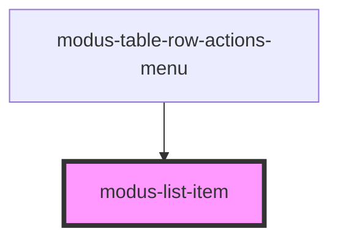

# modus-list-item

<!-- Auto Generated Below -->

## Properties

| Property   | Attribute  | Description                                    | Type                                   | Default      |
| ---------- | ---------- | ---------------------------------------------- | -------------------------------------- | ------------ |
| `disabled` | `disabled` | (optional) Disables the list item              | `boolean`                              | `undefined`  |
| `selected` | `selected` | (optional) The selected state of the list item | `boolean`                              | `undefined`  |
| `size`     | `size`     | (optional) The size of list item               | `"condensed" \| "large" \| "standard"` | `'standard'` |
| `type`     | `type`     | (optional) The type of list item               | `string`                               | `'standard'` |

## Events

| Event       | Description                            | Type               |
| ----------- | -------------------------------------- | ------------------ |
| `itemClick` | An event that fires on list item click | `CustomEvent<any>` |

## Dependencies

### Used by

 - [modus-table-row-actions-menu](../modus-table/parts/row/actions/modus-table-row-actions-menu)

### Graph

----------------------------------------------

