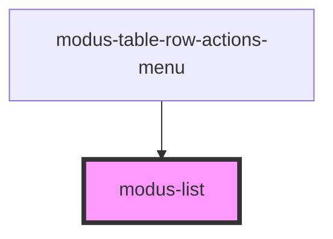

# modus-list

<!-- Auto Generated Below -->

## Shadow Parts

| Part           | Description |
| -------------- | ----------- |
| `"list-items"` |             |

## Dependencies

### Used by

 - [modus-table-row-actions-menu](../modus-table/parts/row/actions/modus-table-row-actions-menu)

### Graph

----------------------------------------------

