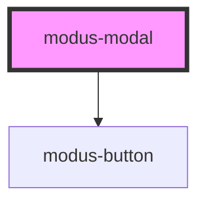

# modus-modal

<!-- Auto Generated Below -->

## Properties

| Property     | Attribute     | Description                                                                                                                          | Type                    | Default     |
| ------------ | ------------- | ------------------------------------------------------------------------------------------------------------------------------------ | ----------------------- | ----------- |
| `ariaLabel`  | `aria-label`  | (optional) The modal's aria-label.                                                                                                   | `string`                | `undefined` |
| `backdrop`   | `backdrop`    | (optional) The modal's backdrop. Specify 'static' for a backdrop that doesn't close the modal when clicked outside the modal content | `"default" \| "static"` | `'default'` |
| `buttons`    | --            | The modal button to render.                                                                                                          | `ModusModalButtons`     | `undefined` |
| `headerText` | `header-text` | (optional) The modal's primary button text.                                                                                          | `string`                | `undefined` |
| `zIndex`     | `z-index`     | (optional) The modal's z-index.                                                                                                      | `string`                | `'1'`       |

## Events

| Event                  | Description                                    | Type               |
| ---------------------- | ---------------------------------------------- | ------------------ |
| `closed`               | An event that fires on modal close.            | `CustomEvent<any>` |
| `opened`               | An event that fires on modal open.             | `CustomEvent<any>` |
| `outlineButtonClick`   | An event that fires on outline button click.   | `CustomEvent<any>` |
| `primaryButtonClick`   | An event that fires on primary button click.   | `CustomEvent<any>` |
| `secondaryButtonClick` | An event that fires on secondary button click. | `CustomEvent<any>` |

## Methods

### `close() => Promise<void>`

Closes the Modal

#### Returns

Type: `Promise<void>`

### `open() => Promise<void>`

Opens the Modal

#### Returns

Type: `Promise<void>`

## Dependencies

### Depends on

- [modus-button](../modus-button)

### Graph

----------------------------------------------

