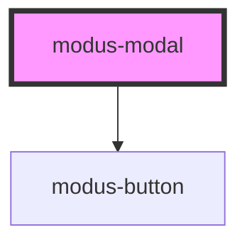

# modus-modal

<!-- Auto Generated Below -->

## Properties

| Property                   | Attribute                     | Description                                         | Type      | Default     |
| -------------------------- | ----------------------------- | --------------------------------------------------- | --------- | ----------- |
| `ariaLabel`                | `aria-label`                  | (optional) The modal's aria-label.                  | `string`  | `undefined` |
| `headerText`               | `header-text`                 | (optional) The modal's primary button text.         | `string`  | `undefined` |
| `primaryButtonAriaLabel`   | `primary-button-aria-label`   | (optional) The modal's primary button aria-label.   | `string`  | `undefined` |
| `primaryButtonDisabled`    | `primary-button-disabled`     | (optional) Disable primary button.                  | `boolean` | `undefined` |
| `primaryButtonText`        | `primary-button-text`         | (optional) The modal's primary button text.         | `string`  | `undefined` |
| `secondaryButtonAriaLabel` | `secondary-button-aria-label` | (optional) The modal's secondary button aria-label. | `string`  | `undefined` |
| `secondaryButtonDisabled`  | `secondary-button-disabled`   | (optional) Disable secondary button.                | `boolean` | `undefined` |
| `secondaryButtonText`      | `secondary-button-text`       | (optional) The modal's secondary button text.       | `string`  | `undefined` |
| `zIndex`                   | `z-index`                     | (optional) The modal's z-index.                     | `string`  | `'1'`       |

## Events

| Event                  | Description                                    | Type               |
| ---------------------- | ---------------------------------------------- | ------------------ |
| `closed`               | An event that fires on modal close.            | `CustomEvent<any>` |
| `opened`               | An event that fires on modal open.             | `CustomEvent<any>` |
| `primaryButtonClick`   | An event that fires on primary button click.   | `CustomEvent<any>` |
| `secondaryButtonClick` | An event that fires on secondary button click. | `CustomEvent<any>` |

## Methods

### `close() => Promise<void>`

Closes the Modal

#### Returns

Type: `Promise<void>`

### `open() => Promise<void>`

Opens the Modal

#### Returns

Type: `Promise<void>`

## Dependencies

### Depends on

- [modus-button](../modus-button)

### Graph

----------------------------------------------

