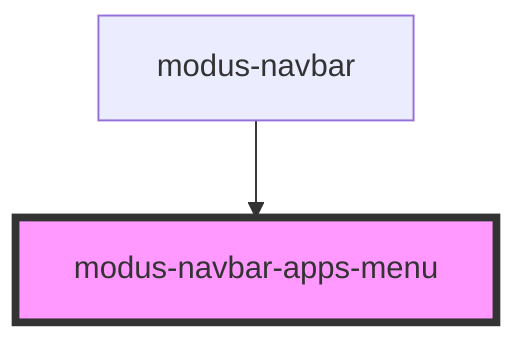

# modus-navbar-apps-menu

<!-- Auto Generated Below -->

## Properties

| Property  | Attribute | Description | Type               | Default     |
| --------- | --------- | ----------- | ------------------ | ----------- |
| `apps`    | --        |             | `ModusNavbarApp[]` | `undefined` |
| `reverse` | `reverse` |             | `boolean`          | `undefined` |

## Events

| Event     | Description | Type                          |
| --------- | ----------- | ----------------------------- |
| `appOpen` |             | `CustomEvent<ModusNavbarApp>` |

## Dependencies

### Used by

 - [modus-navbar](..)

### Graph

----------------------------------------------

