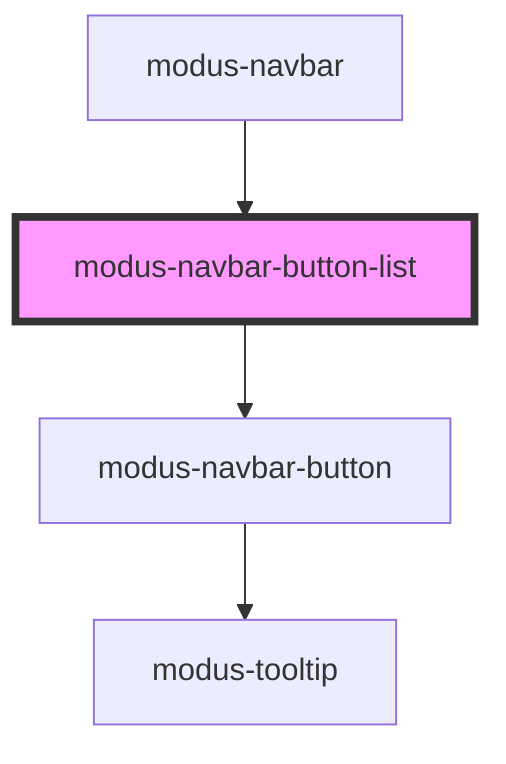

# modus-navbar-button-list

<!-- Auto Generated Below -->

## Properties

| Property  | Attribute | Description                                     | Type                  | Default     |
| --------- | --------- | ----------------------------------------------- | --------------------- | ----------- |
| `buttons` | --        | (optional) The buttons to render in the Navbar. | `ModusNavbarButton[]` | `undefined` |

## Events

| Event         | Description | Type                  |
| ------------- | ----------- | --------------------- |
| `buttonClick` |             | `CustomEvent<string>` |

## Dependencies

### Used by

 - [modus-navbar](..)

### Depends on

- [modus-navbar-button](../button)

### Graph

----------------------------------------------

