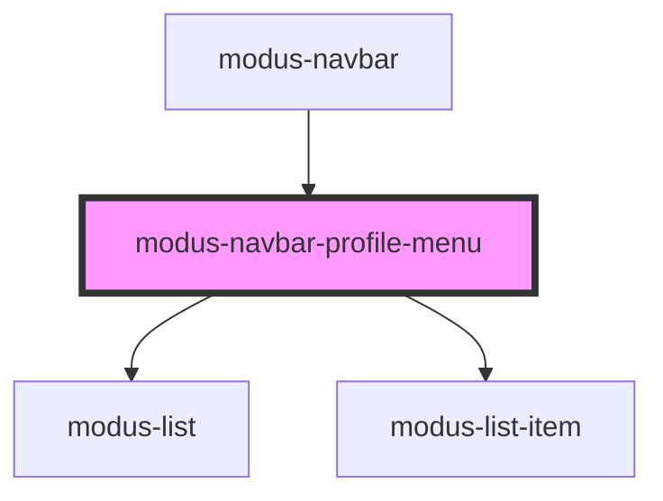

# modus-navbar-profile-menu

<!-- Auto Generated Below -->

## Properties

| Property          | Attribute           | Description | Type                           | Default      |
| ----------------- | ------------------- | ----------- | ------------------------------ | ------------ |
| `avatarUrl`       | `avatar-url`        |             | `string`                       | `undefined`  |
| `email`           | `email`             |             | `string`                       | `undefined`  |
| `initials`        | `initials`          |             | `string`                       | `undefined`  |
| `links`           | --                  |             | `ModusNavbarProfileMenuLink[]` | `undefined`  |
| `profileMenuText` | `profile-menu-text` |             | `string`                       | `'Sign out'` |
| `reverse`         | `reverse`           |             | `boolean`                      | `undefined`  |
| `username`        | `username`          |             | `string`                       | `undefined`  |
| `variant`         | `variant`           |             | `"blue" \| "default"`          | `'default'`  |

## Events

| Event          | Description | Type                      |
| -------------- | ----------- | ------------------------- |
| `linkClick`    |             | `CustomEvent<string>`     |
| `signOutClick` |             | `CustomEvent<MouseEvent>` |

## Dependencies

### Used by

 - [modus-navbar](..)

### Depends on

- [modus-list](../../modus-list)
- [modus-list-item](../../modus-list-item)

### Graph

----------------------------------------------

