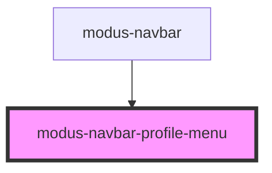

# modus-navbar-profile-menu

<!-- Auto Generated Below -->

## Properties

| Property    | Attribute    | Description | Type                           | Default     |
| ----------- | ------------ | ----------- | ------------------------------ | ----------- |
| `avatarUrl` | `avatar-url` |             | `string`                       | `undefined` |
| `email`     | `email`      |             | `string`                       | `undefined` |
| `initials`  | `initials`   |             | `string`                       | `undefined` |
| `links`     | --           |             | `ModusNavbarProfileMenuLink[]` | `undefined` |
| `reverse`   | `reverse`    |             | `boolean`                      | `undefined` |
| `username`  | `username`   |             | `string`                       | `undefined` |

## Events

| Event          | Description | Type                      |
| -------------- | ----------- | ------------------------- |
| `linkClick`    |             | `CustomEvent<string>`     |
| `signOutClick` |             | `CustomEvent<MouseEvent>` |

## Dependencies

### Used by

 - [modus-navbar](..)

### Graph

----------------------------------------------

