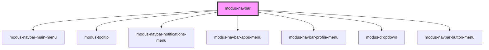

# modus-navbar

<!-- Auto Generated Below -->

## Properties

| Property               | Attribute                | Description                                                                                                                                                                             | Type                      | Default     |
| ---------------------- | ------------------------ | --------------------------------------------------------------------------------------------------------------------------------------------------------------------------------------- | ------------------------- | ----------- |
| `apps`                 | --                       | (optional) The apps to render in the apps menu.                                                                                                                                         | `ModusNavbarApp[]`        | `undefined` |
| `buttons`              | --                       | (optional) The buttons to render in the Navbar.                                                                                                                                         | `ModusNavbarButton[]`     | `undefined` |
| `helpUrl`              | `help-url`               | (optional) Help URL.                                                                                                                                                                    | `string`                  | `undefined` |
| `logoOptions`          | --                       | (optional) Set the primary logo to display when the screen size is greater than 576 pixels, and the secondary logo to display when the screen size is less than or equal to 576 pixels. | `ModusNavbarLogoOptions`  | `undefined` |
| `profileMenuOptions`   | --                       | (required) Profile menu options.                                                                                                                                                        | `ModusProfileMenuOptions` | `undefined` |
| `reverse`              | `reverse`                | (optional) Whether to display the navbar items in reverse order.                                                                                                                        | `boolean`                 | `undefined` |
| `searchTooltip`        | --                       | (optional) Search tooltip.                                                                                                                                                              | `ModusNavbarTooltip`      | `undefined` |
| `showAppsMenu`         | `show-apps-menu`         | (optional) Whether to show the apps menu.                                                                                                                                               | `boolean`                 | `undefined` |
| `showHelp`             | `show-help`              | (optional) Whether to show help.                                                                                                                                                        | `boolean`                 | `undefined` |
| `showMainMenu`         | `show-main-menu`         | (optional) Whether to show the main menu.                                                                                                                                               | `boolean`                 | `undefined` |
| `showNotifications`    | `show-notifications`     | (optional) Whether to show notifications.                                                                                                                                               | `boolean`                 | `undefined` |
| `showPendoPlaceholder` | `show-pendo-placeholder` | (optional) Whether to show the placeholder for Pendo.                                                                                                                                   | `boolean`                 | `undefined` |
| `showSearch`           | `show-search`            | (optional) Whether to show search.                                                                                                                                                      | `boolean`                 | `undefined` |
| `showShadow`           | `show-shadow`            | (optional) Whether to show a shadow under the navbar.                                                                                                                                   | `boolean`                 | `undefined` |
| `variant`              | `variant`                | (optional) Color variants for NavBar.                                                                                                                                                   | `"blue" \| "default"`     | `'default'` |

## Events

| Event                     | Description                                            | Type                                       |
| ------------------------- | ------------------------------------------------------ | ------------------------------------------ |
| `appsMenuAppOpen`         | An event that fires when an apps menu app opens.       | `CustomEvent<ModusNavbarApp>`              |
| `appsMenuOpen`            | An event that fires when the apps menu opens.          | `CustomEvent<void>`                        |
| `helpOpen`                | An event that fires when the help link opens.          | `CustomEvent<void>`                        |
| `mainMenuClick`           | An event that fires on main menu click.                | `CustomEvent<KeyboardEvent \| MouseEvent>` |
| `notificationsMenuOpen`   | An event that fires when the notifications menu opens. | `CustomEvent<void>`                        |
| `productLogoClick`        | An event that fires on product logo click.             | `CustomEvent<MouseEvent>`                  |
| `profileMenuLinkClick`    | An event that fires on profile menu link click.        | `CustomEvent<string>`                      |
| `profileMenuOpen`         | An event that fires when the profile menu opens.       | `CustomEvent<void>`                        |
| `profileMenuSignOutClick` | An event that fires on profile menu sign out click.    | `CustomEvent<MouseEvent>`                  |

## Methods

### `hideMainMenu() => Promise<void>`

#### Returns

Type: `Promise<void>`

## Slots

| Slot              | Description                          |
| ----------------- | ------------------------------------ |
| `"main"`          | Renders custom main menu content     |
| `"notifications"` | Renders custom notifications content |

## Dependencies

### Depends on

- [modus-navbar-main-menu](main-menu)
- [modus-tooltip](../modus-tooltip)
- [modus-navbar-notifications-menu](notifications-menu)
- [modus-navbar-apps-menu](apps-menu)
- [modus-navbar-profile-menu](profile-menu)
- [modus-dropdown](../modus-dropdown)
- [modus-navbar-button-menu](button-menu)

### Graph

----------------------------------------------

