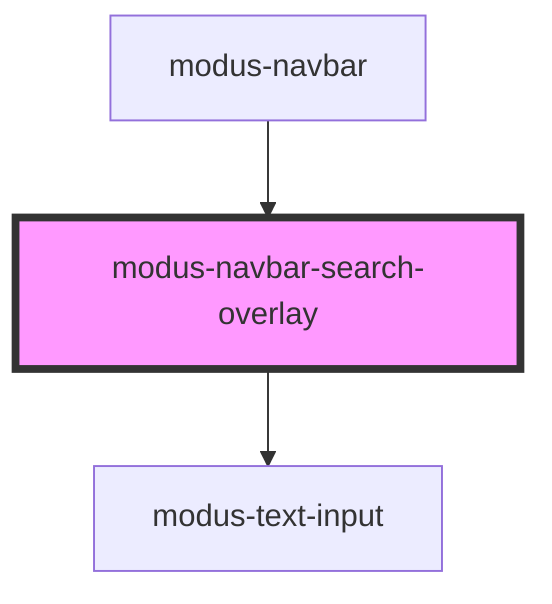

# modus-navbar-search-overlay

<!-- Auto Generated Below -->

## Events

| Event    | Description                                                       | Type                  |
| -------- | ----------------------------------------------------------------- | --------------------- |
| `close`  | An event that fires on clicking on close button of search overlay | `CustomEvent<void>`   |
| `search` | An event that fires on search value change.                       | `CustomEvent<string>` |

## Dependencies

### Used by

 - [modus-navbar](..)

### Depends on

- [modus-text-input](../../modus-text-input)

### Graph

----------------------------------------------

