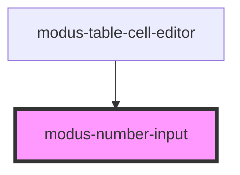

# modus-number-input

<!-- Auto Generated Below -->

## Properties

| Property      | Attribute     | Description                                                   | Type                  | Default     |
| ------------- | ------------- | ------------------------------------------------------------- | --------------------- | ----------- |
| `ariaLabel`   | `aria-label`  | (optional) The input's aria-label.                            | `string`              | `undefined` |
| `disabled`    | `disabled`    | (optional) Whether the input is disabled.                     | `boolean`             | `undefined` |
| `errorText`   | `error-text`  | (optional) The input's error state text.                      | `string`              | `undefined` |
| `helperText`  | `helper-text` | (optional) The input's helper text displayed below the input. | `string`              | `undefined` |
| `label`       | `label`       | (optional) The input's label.                                 | `string`              | `undefined` |
| `maxValue`    | `max-value`   | (optional) The input's maximum value.                         | `number`              | `undefined` |
| `minValue`    | `min-value`   | (optional) The input's minimum value.                         | `number`              | `undefined` |
| `placeholder` | `placeholder` | (optional) The input's placeholder text.                      | `string`              | `undefined` |
| `readOnly`    | `read-only`   | (optional) Whether the input's content is read-only           | `boolean`             | `undefined` |
| `required`    | `required`    | (optional) Whether the input is required.                     | `boolean`             | `undefined` |
| `size`        | `size`        | (optional) The input's size.                                  | `"large" \| "medium"` | `'medium'`  |
| `step`        | `step`        | (optional) The input's step.                                  | `number`              | `undefined` |
| `textAlign`   | `text-align`  | (optional) The input's text alignment.                        | `"left" \| "right"`   | `'left'`    |
| `validText`   | `valid-text`  | (optional) The input's valid state text.                      | `string`              | `undefined` |
| `value`       | `value`       | (optional) The input's value.                                 | `string`              | `undefined` |

## Events

| Event         | Description                                | Type                  |
| ------------- | ------------------------------------------ | --------------------- |
| `valueChange` | An event that fires on input value change. | `CustomEvent<string>` |

## Methods

### `focusInput() => Promise<void>`

Focus the input.

#### Returns

Type: `Promise<void>`

## Shadow Parts

| Part                | Description |
| ------------------- | ----------- |
| `"input-container"` |             |

## Dependencies

### Used by

 - [modus-table-cell-editor](../modus-table/parts/cell/modus-table-cell-editor)

### Graph

----------------------------------------------

