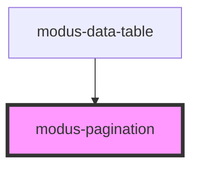

# modus-pagination

<!-- Auto Generated Below -->

## Properties

| Property     | Attribute     | Description | Type                             | Default     |
| ------------ | ------------- | ----------- | -------------------------------- | ----------- |
| `activePage` | `active-page` |             | `number`                         | `undefined` |
| `ariaLabel`  | `aria-label`  |             | `string`                         | `undefined` |
| `maxPage`    | `max-page`    |             | `number`                         | `undefined` |
| `minPage`    | `min-page`    |             | `number`                         | `undefined` |
| `size`       | `size`        |             | `"large" \| "medium" \| "small"` | `'medium'`  |

## Events

| Event        | Description                         | Type                  |
| ------------ | ----------------------------------- | --------------------- |
| `pageChange` | An event that fires on page change. | `CustomEvent<number>` |

## Dependencies

### Used by

 - [modus-data-table](../modus-data-table)

### Graph

----------------------------------------------

