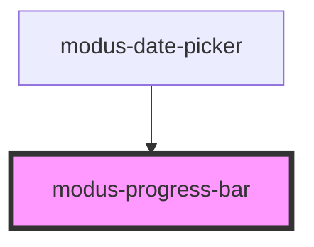

# modus-progress

<!-- Auto Generated Below -->

## Properties

| Property          | Attribute          | Description                                        | Type                                | Default         |
| ----------------- | ------------------ | -------------------------------------------------- | ----------------------------------- | --------------- |
| `ariaLabel`       | `aria-label`       | (optional) The progress bar's aria-label.          | `string`                            | `undefined`     |
| `backgroundColor` | `background-color` | (optional) The progress bar's background color.    | `string`                            | `undefined`     |
| `color`           | `color`            | (optional) The progress bar's foreground color.    | `string`                            | `undefined`     |
| `maxValue`        | `max-value`        | (optional) The progress bar's maximum value.       | `number`                            | `100`           |
| `minValue`        | `min-value`        | (optional) The progress bar's minimum value.       | `number`                            | `0`             |
| `mode`            | `mode`             | (optional) The progress bar's mode.                | `"determinate" \| "indeterminate"`  | `'determinate'` |
| `size`            | `size`             | (optional) The progress bar's size.                | `"compact" \| "default" \| "small"` | `'default'`     |
| `text`            | `text`             | (optional) The text displayed on the progress bar. | `string`                            | `undefined`     |
| `textColor`       | `text-color`       | (optional) The progress bar's text color.          | `string`                            | `undefined`     |
| `value`           | `value`            | (optional) The progress bar's value.               | `number`                            | `0`             |

## Dependencies

### Used by

 - [modus-date-picker](../modus-date-picker)

### Graph

----------------------------------------------

