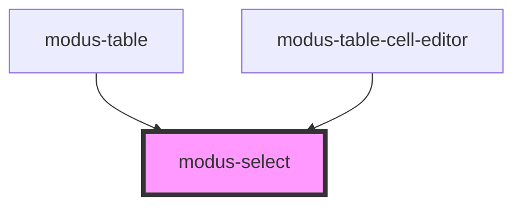

# modus-select

<!-- Auto Generated Below -->

## Properties

| Property             | Attribute              | Description                                          | Type                  | Default     |
| -------------------- | ---------------------- | ---------------------------------------------------- | --------------------- | ----------- |
| `ariaLabel`          | `aria-label`           | (optional) The select's aria-label.                  | `string`              | `undefined` |
| `disabled`           | `disabled`             | (optional) Whether the input is disabled.            | `boolean`             | `undefined` |
| `errorText`          | `error-text`           | (optional) The input's error text.                   | `string`              | `undefined` |
| `helperText`         | `helper-text`          | (optional) The input's helper text.                  | `string`              | `undefined` |
| `label`              | `label`                | (optional) The input label.                          | `string`              | `undefined` |
| `options`            | --                     | The options for the dropdown list.                   | `unknown[]`           | `[]`        |
| `optionsDisplayProp` | `options-display-prop` | The options property to render in the dropdown list. | `string`              | `undefined` |
| `required`           | `required`             | (optional) Whether the input is required.            | `boolean`             | `undefined` |
| `size`               | `size`                 | (optional) The input's size.                         | `"large" \| "medium"` | `'medium'`  |
| `validText`          | `valid-text`           | (optional) The input's valid text.                   | `string`              | `undefined` |
| `value`              | --                     | (optional) The input value.                          | `unknown`             | `undefined` |

## Events

| Event         | Description                                | Type                      |
| ------------- | ------------------------------------------ | ------------------------- |
| `inputBlur`   | An event that fires on input blur.         | `CustomEvent<FocusEvent>` |
| `valueChange` | An event that fires on input value change. | `CustomEvent<unknown>`    |

## Methods

### `focusInput() => Promise<void>`

Focus the input.

#### Returns

Type: `Promise<void>`

## Shadow Parts

| Part      | Description |
| --------- | ----------- |
| `"input"` |             |

## Dependencies

### Used by

 - [modus-table](../modus-table)
 - [modus-table-cell-editor](../modus-table/parts/cell/modus-table-cell-editor)

### Graph

----------------------------------------------

