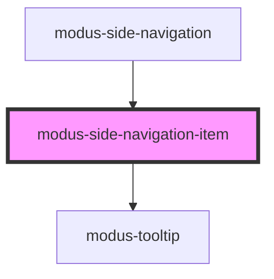

# modus-side-navigation-item

<!-- Auto Generated Below -->

## Properties

| Property   | Attribute   | Description                                                  | Type      | Default     |
| ---------- | ----------- | ------------------------------------------------------------ | --------- | ----------- |
| `disabled` | `disabled`  | (optional) The disabled state of side navigation panel item. | `boolean` | `false`     |
| `expanded` | `expanded`  | (optional) The expanded state of side navigation panel item. | `boolean` | `false`     |
| `label`    | `label`     | (optional) Label for the item and the tooltip message.       | `string`  | `undefined` |
| `menuIcon` | `menu-icon` | (optional) A built-in menu icon string or a image url.       | `string`  | `undefined` |
| `selected` | `selected`  | (optional) The selected state of side navigation panel item. | `boolean` | `false`     |

## Events

| Event                         | Description                                                      | Type                                              |
| ----------------------------- | ---------------------------------------------------------------- | ------------------------------------------------- |
| `sideNavItemFocus`            | An event that fires when an item is in focus.                    | `CustomEvent<{ id: string; }>`                    |
| `sideNavItemLevelExpandClick` | An event that fires when an item's level expand icon is clicked. | `CustomEvent<{ id: string; }>`                    |
| `sideNavItemSelected`         | An event that fires on item selection.                           | `CustomEvent<{ id: string; selected: boolean; }>` |

## Methods

### `focusItem() => Promise<void>`

#### Returns

Type: `Promise<void>`

## Dependencies

### Used by

 - [modus-side-navigation](..)

### Depends on

- [modus-tooltip](../../modus-tooltip)

### Graph

----------------------------------------------

