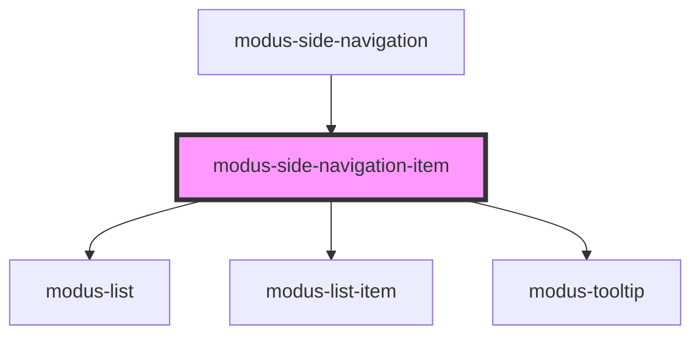

# modus-side-navigation-item

<!-- Auto Generated Below -->

## Properties

| Property           | Attribute           | Description                                                  | Type                            | Default                         |
| ------------------ | ------------------- | ------------------------------------------------------------ | ------------------------------- | ------------------------------- |
| `disableSelection` | `disable-selection` | (optional) Disables item selection.                          | `boolean`                       | `false`                         |
| `disabled`         | `disabled`          | (optional) The disabled state of side navigation panel item. | `boolean`                       | `false`                         |
| `isHeader`         | --                  | (optional to enable header dropdown feature)                 | `ModusHeaderNavigationItemInfo` | `{ enabled: false, items: [] }` |
| `label`            | `label`             | (optional) Label for the item and the tooltip message.       | `string`                        | `undefined`                     |
| `menuIcon`         | `menu-icon`         | (optional) A built-in menu icon string or a image url.       | `string`                        | `undefined`                     |
| `selected`         | `selected`          | (optional) The selected state of side navigation panel item. | `boolean`                       | `false`                         |
| `showExpandIcon`   | `show-expand-icon`  | (optional) Shows the expand icon.                            | `boolean`                       | `false`                         |

## Events

| Event                      | Description                                                             | Type                                              |
| -------------------------- | ----------------------------------------------------------------------- | ------------------------------------------------- |
| `sideNavItemClicked`       | An event that fires when a mouse click or `Enter` key press on an item. | `CustomEvent<{ id: string; selected: boolean; }>` |
| `sideNavItemFocus`         | An event that fires when an item is in focus.                           | `CustomEvent<{ id: string; }>`                    |
| `sideNavItemHeaderClicked` |                                                                         | `CustomEvent<{ id: string; selected: boolean; }>` |
| `sideNavListItemClicked`   |                                                                         | `CustomEvent<{ id: string; }>`                    |

## Methods

### `focusItem() => Promise<void>`

#### Returns

Type: `Promise<void>`

## Dependencies

### Used by

 - [modus-side-navigation](..)

### Depends on

- [modus-list](../../modus-list)
- [modus-list-item](../../modus-list-item)
- [modus-tooltip](../../modus-tooltip)

### Graph

----------------------------------------------

