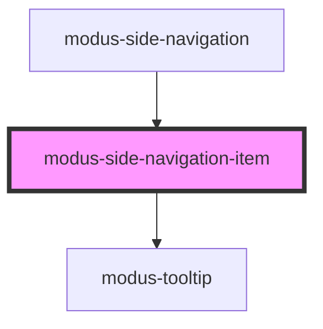

# modus-side-navigation-item

<!-- Auto Generated Below -->

## Properties

| Property      | Attribute       | Description                                                  | Type      | Default     |
| ------------- | --------------- | ------------------------------------------------------------ | --------- | ----------- |
| `disabled`    | `disabled`      | (optional) The disabled state of side navigation panel item. | `boolean` | `false`     |
| `expanded`    | `expanded`      | (optional) The expanded state of side navigation panel item. | `boolean` | `false`     |
| `label`       | `label`         | (optional) Label for the item and the tooltip message.       | `string`  | `undefined` |
| `menuIconUrl` | `menu-icon-url` | (optional) Url Menu Icon url.                                | `string`  | `undefined` |
| `selected`    | `selected`      | (optional) The selected state of side navigation panel item. | `boolean` | `false`     |

## Events

| Event                 | Description                            | Type                   |
| --------------------- | -------------------------------------- | ---------------------- |
| `sideNavItemSelected` | An event that fires on item selection. | `CustomEvent<boolean>` |

## Dependencies

### Used by

 - [modus-side-navigation](..)

### Depends on

- [modus-tooltip](../../modus-tooltip)

### Graph

----------------------------------------------

