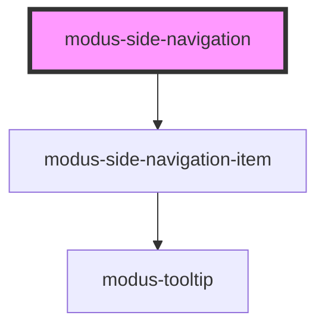

# modus-side-navigation

<!-- Auto Generated Below -->

## Properties

| Property   | Attribute   | Description                                                                 | Type                            | Default     |
| ---------- | ----------- | --------------------------------------------------------------------------- | ------------------------------- | ----------- |
| `data`     | --          | (optional) Data property to create the items.                               | `ModusSideNavigationItemInfo[]` | `undefined` |
| `expanded` | `expanded`  | (optional) The expanded state of side navigation panel and items.           | `boolean`                       | `false`     |
| `maxWidth` | `max-width` | (optional) Maximum width of the side navigation panel in an expanded state. | `string`                        | `'256px'`   |

## Events

| Event           | Description                                                     | Type                   |
| --------------- | --------------------------------------------------------------- | ---------------------- |
| `sideNavExpand` | An event that fires on side navigation panel collapse & expand. | `CustomEvent<boolean>` |

## Dependencies

### Depends on

- [modus-side-navigation-item](modus-side-navigation-item)

### Graph

----------------------------------------------

