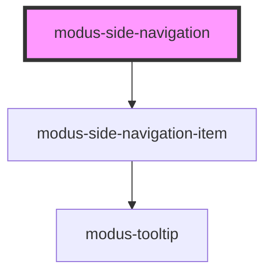

# modus-side-navigation

<!-- Auto Generated Below -->

## Properties

| Property                 | Attribute                   | Description                                                                                                                               | Type                            | Default     |
| ------------------------ | --------------------------- | ----------------------------------------------------------------------------------------------------------------------------------------- | ------------------------------- | ----------- |
| `collapseOnClickOutside` | `collapse-on-click-outside` | (optional) To choose whether to collapse the panel when clicked outside.                                                                  | `boolean`                       | `true`      |
| `data`                   | --                          | (optional) Data property to create the items.                                                                                             | `ModusSideNavigationItemInfo[]` | `undefined` |
| `expanded`               | `expanded`                  | (optional) The expanded state of side navigation panel and items.                                                                         | `boolean`                       | `false`     |
| `maxWidth`               | `max-width`                 | (optional) Maximum width of the side navigation panel in an expanded state.                                                               | `string`                        | `'256px'`   |
| `mode`                   | `mode`                      | Mode to make side navigation either overlay or push the content for the selector specified in `targetContent`                             | `"overlay" \| "push"`           | `'overlay'` |
| `targetContent`          | `target-content`            | (optional) Specify the selector for the page's content for which paddings and margins will be set by side navigation based on the `mode`. | `string`                        | `undefined` |

## Events

| Event           | Description                                                     | Type                   |
| --------------- | --------------------------------------------------------------- | ---------------------- |
| `sideNavExpand` | An event that fires on side navigation panel collapse & expand. | `CustomEvent<boolean>` |

## Dependencies

### Depends on

- [modus-side-navigation-item](modus-side-navigation-item)

### Graph

----------------------------------------------

