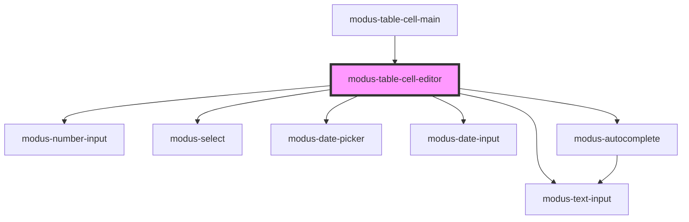

# modus-table-filler-column

<!-- Auto Generated Below -->

## Properties

| Property       | Attribute | Description | Type                                             | Default     |
| -------------- | --------- | ----------- | ------------------------------------------------ | ----------- |
| `args`         | --        |             | `{ format: string; } \| { options: unknown[]; }` | `undefined` |
| `type`         | `type`    |             | `string`                                         | `undefined` |
| `value`        | `value`   |             | `string`                                         | `undefined` |
| `valueEntered` | --        |             | `(newValue: string, oldValue: string) => void`   | `undefined` |

## Dependencies

### Used by

 - [modus-table-cell-main](../modus-table-cell-main)

### Depends on

- [modus-number-input](../../../../modus-number-input)
- [modus-text-input](../../../../modus-text-input)
- [modus-select](../../../../modus-select)
- [modus-date-picker](../../../../modus-date-picker)
- [modus-date-input](../../../../modus-date-input)
- [modus-autocomplete](../../../../modus-autocomplete)

### Graph

----------------------------------------------

